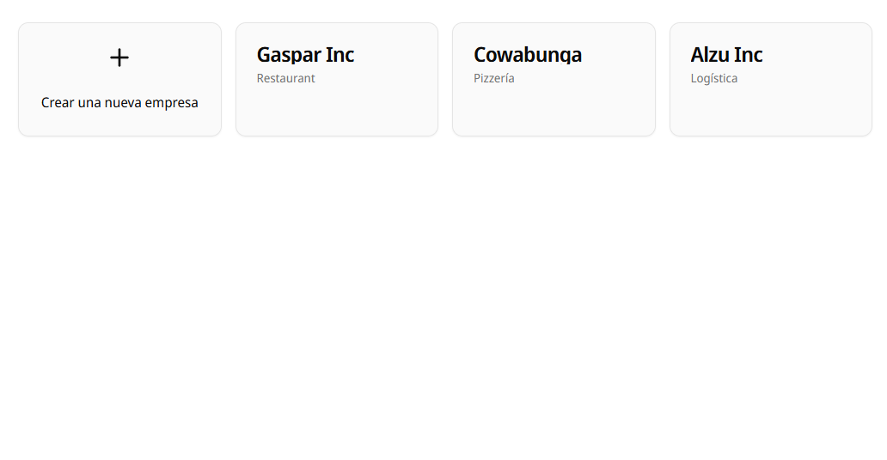
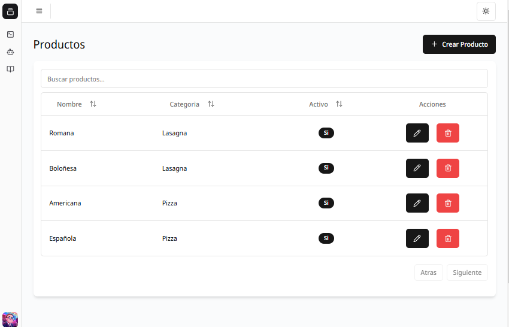
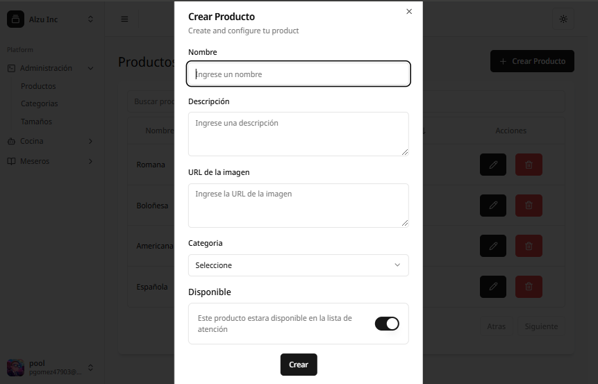
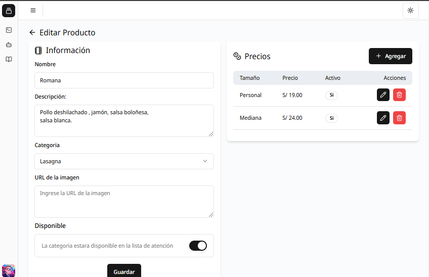

# App Web Alzu

Este es un proyecto para la gestion comercial multiempresa.

en desarrollo...

## Tecnologías
<table align="center">
  <tr>
    <td align="center">
      <a href="https://www.typescriptlang.org/">
         
        TypeScript
      </a>
    </td>
    <td align="center">
      <a href="https://nextjs.org/">
         
        Next.js
      </a>
    </td>
    <td align="center">
      <a href="https://www.postgresql.org/">
         
        PostgreSQL
      </a>
    </td>
    <td align="center">
      <a href="https://tailwindcss.com/">
       
        Tailwind
      </a>
    </td>   
    <td align="center">
      <a href="https://www.prisma.io/">
       
        Prisma
      </a>
    </td> 
    <td align="center">
      <a href="https://authjs.dev/">
       
        Auth.js
      </a>
    </td> 
  </tr>
</table>

## Capturas

